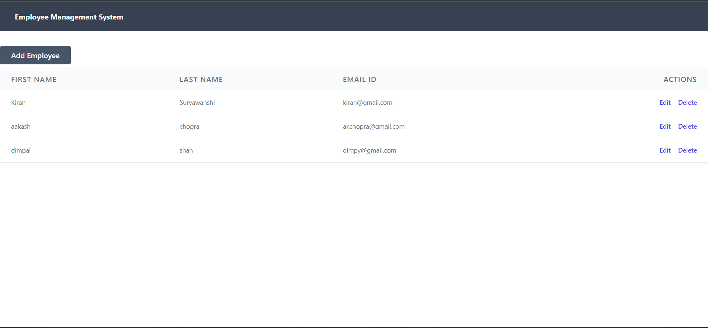
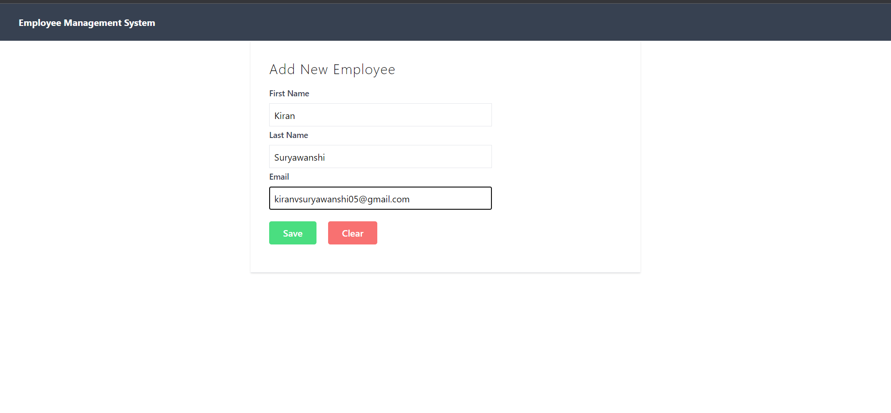
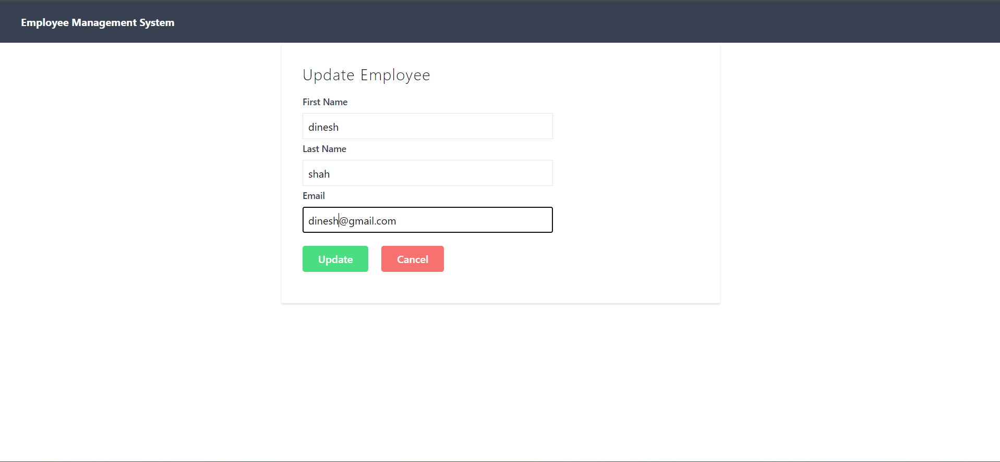

# Employee Management System

This project is an Employee Management System developed using Java, React, and Spring Boot. It provides functionalities to manage employee data.

## Prerequisites

Ensure the following software is installed on your system:

- Java 11
- Node.js
- npm
- Maven
- PostgreSQL

## Getting Started

### Backend (Spring Boot)

1. **Clone the repository:**

    ```bash
    git clone https://github.com/your-username/employee-management-system.git
    ```

2. **Navigate to the backend folder:**

    ```bash
    cd employee-management-system/backend
    ```

3. **Set up the PostgreSQL database:**
   
    - Create a database named `employee_management_system` in PostgreSQL.
    - Update the `application.properties` file in `src/main/resources` with your database configuration.

4. **Run the Spring Boot application:**

    ```bash
    mvn spring-boot:run
    ```

5. The backend server will start at `http://localhost:8080`.

### Frontend (React)

1. **Navigate to the frontend folder:**

    ```bash
    cd employee-management-system/frontend
    ```

2. **Install dependencies:**

    ```bash
    npm install
    ```

3. **Start the React development server:**

    ```bash
    npm start
    ```

4. The frontend will be available at `http://localhost:3000`.

## Usage

- Access the frontend in your browser at `http://localhost:3000` to interact with the Employee Management System.
- Use the provided functionalities to manage employee data, including adding, updating, deleting, and viewing employee information.

## Screenshots

Here are screenshots of the project:



  This is Main Screen of Application.




  Adding Employee details



  Updating Record

The screenshots are available in the `screenshots` directory within the project.

## Contributing

Feel free to contribute by opening issues or pull requests.

## License

This project is licensed under the [MIT License](LICENSE).
